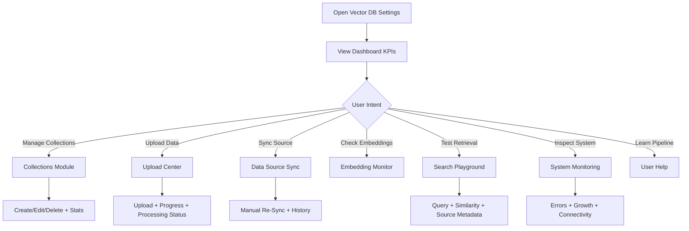

# Vector DB Settings Redesign Blueprint

## Scope and Constraints
- Goal: redesign the Vector DB Settings user interface into a modern enterprise dashboard.
- Constraint: no backend logic, data models, service layer, or API contract changes.
- Approach: UI-only restructuring, componentized layout, and progressive disclosure for advanced actions.

## Design Direction
- Visual style: Azure and Databricks inspired enterprise console.
- Primary traits: dense but readable data cards, clear hierarchy, status-first design, low-click workflows.
- Interaction model: left rail navigation with persistent summary cards and contextual right-side details.

## Information Architecture
1. Dashboard
2. Collections Management
3. Data Upload Center
4. Data Source Sync
5. Embedding Monitor
6. Search Playground
7. System Monitoring
8. User Help

## Page Structure

### Global Shell
- Top bar
  - Page title: Vector DB Settings
  - Environment badge (Dev, QA, Prod)
  - Last refresh timestamp
  - Global actions: Refresh, Export, Open Logs
- Left navigation
  - Dashboard
  - Collections
  - Upload Center
  - Data Source Sync
  - Embedding Monitor
  - Search Playground
  - System Monitoring
  - User Help
- Main content area
  - Responsive card grid
  - Table views
  - Slide-over detail panels

### Module 1: Dashboard
Cards:
- Total Collections
- Total Vectors
- Total Documents
- Qdrant Status
- Recent Activities feed

Status language:
- Green: Connected and healthy
- Amber: Degraded or warnings
- Red: Disconnected or critical errors

### Module 2: Collections Management
Views:
- Collection table with filters and health badge
- Create Collection modal
- Edit Collection side panel
- Delete confirmation dialog
- Statistics drawer (vector count, dimensions, growth)

### Module 3: Data Upload Center
Components:
- Drag and drop upload zone
- File queue with per-file progress bars
- Processing pipeline status chips
- Failed item retry action

### Module 4: Data Source Sync
Views:
- Data source list (API endpoints and connector status)
- Sync status badges
- Last sync time and duration
- Sync history table
- Manual Re-Sync primary button

### Module 5: Embedding Monitor
Cards and table:
- Embedding model
- Chunk count
- Embedding dimension
- Processing status
- Success and failed counters

### Module 6: Search Playground
Controls and outputs:
- Query input with optional top-k selector
- Retrieved chunk cards
- Similarity score badge on each chunk
- Source metadata panel

### Module 7: System Monitoring
Views:
- Qdrant connectivity card
- Collection size usage bars
- Vector growth trend chart
- Error log timeline table

### Module 8: User Help
Visual learning panel:
- Document -> Chunking -> Embedding -> Qdrant Storage -> Semantic Search
- Interactive tooltips for each stage
- Short practical definitions and troubleshooting tips

## Wireframes

### A. Overall Layout

```text
+-----------------------------------------------------------------------------------+
| Vector DB Settings                 [Env: Prod] [Last Refresh] [Refresh] [Logs]  |
+---------------------------+-------------------------------------------------------+
| Dashboard                 | KPI Cards: Collections | Vectors | Docs | Status      |
| Collections               |-------------------------------------------------------|
| Upload Center             | Recent Activities Feed                                |
| Data Source Sync          |-------------------------------------------------------|
| Embedding Monitor         | Main Module Content Area                              |
| Search Playground         | (Tables, Charts, Upload Queue, Search Results)        |
| System Monitoring         |                                                       |
| User Help                 |                                                       |
+---------------------------+-------------------------------------------------------+
```

### B. Collections Management

```text
+-----------------------------------------------------------------------------------+
| Collections Management                                           [Create] [Refresh]|
+-----------------------------------------------------------------------------------+
| Filters: [Health] [Owner] [Dimension] [Search...]                                |
|-----------------------------------------------------------------------------------|
| Name         Health   Vectors   Docs   Dimension   Last Updated    Actions        |
| customer_kb  Green    1.2M      12k    1536        2 min ago       Edit Delete    |
| billing_kb   Amber    860k      8k     1536        20 min ago      Edit Delete    |
+-----------------------------------------------------------------------------------+
| Right Drawer: Collection Statistics (Trend, Storage, Query Latency)              |
+-----------------------------------------------------------------------------------+
```

### C. Upload Center

```text
+-----------------------------------------------------------------------------------+
| Upload Center                                                                      |
+-----------------------------------------------------------------------------------+
| [ Drag and drop files here ]  [Browse Files]                                      |
|-----------------------------------------------------------------------------------|
| File Name         Size    Progress      Status         Action                      |
| q1_report.pdf     4MB     [=====---]    Embedding      View Logs                  |
| kb_dump.json      12MB    [========]    Completed      Reprocess                  |
+-----------------------------------------------------------------------------------+
```

## UX Flow



## Component Hierarchy

```text
VectorDBSettingsPage
  AppShell
    TopBar
    SideNav
    ContentArea
      DashboardSection
        KpiCardGrid
        StatusCard
        RecentActivityList
      CollectionsSection
        CollectionsToolbar
        CollectionsTable
        CollectionHealthBadge
        CollectionStatsDrawer
      UploadCenterSection
        UploadDropzone
        UploadQueueTable
        UploadProgressBar
      DataSourceSyncSection
        SourceConnectionCard
        SyncStatusTable
        SyncHistoryPanel
      EmbeddingMonitorSection
        EmbeddingSummaryCards
        EmbeddingJobsTable
      SearchPlaygroundSection
        QueryControls
        RetrievalResultsList
        SourceMetadataPanel
      SystemMonitoringSection
        ConnectivityCard
        CollectionUsageChart
        VectorGrowthChart
        ErrorLogTable
      UserHelpSection
        PipelineDiagram
        TooltipLegend
```

## React Page Layout Recommendation
- Keep all module sections on one page with tab/rail navigation.
- Use lightweight state for active module, local filters, and loading indicators.
- Keep API calls isolated in a data service adapter layer; UI consumes normalized view models.
- Use optimistic UI only for safe actions (refresh, local filters), not destructive actions.

## Status Badge System
- Green: success and healthy.
- Amber: warning and degraded.
- Red: failure and critical.
- Gray: unknown and not yet checked.

Suggested tokens:
- Green: #1F8F4E
- Amber: #C88A04
- Red: #C63131
- Gray: #6B7280

## Tooltips and Empty States
- Add helper tooltip on first use for:
  - Collection health score definition
  - Similarity score interpretation
  - Chunking and embedding explanation
- Empty states should include a direct action button:
  - No collections -> Create Collection
  - No uploads -> Upload First File
  - No sync history -> Run First Sync

## Performance and Responsiveness
- Desktop: 12-column card grid.
- Tablet: 8-column grid, reduced side padding.
- Mobile: 1-column stacked cards with sticky top actions.
- Virtualize long tables for logs and histories.

## Accessibility and Enterprise Readiness
- Keyboard-navigable controls and modals.
- Color + text labels on statuses for non-color users.
- Focus ring visibility on all interactive elements.
- Audit-friendly activity timeline with timestamp and actor labels.

## Implementation Plan (UI Only)
1. Build shared primitives: Card, Badge, ProgressBar, EmptyState, Tooltip.
2. Build shell layout: top bar, side navigation, responsive content container.
3. Implement modules in priority order:
   - Dashboard
   - Collections
   - Upload Center
   - Search Playground
   - Monitoring modules
4. Add skeleton states and loading placeholders.
5. Add visual QA pass for spacing, hierarchy, and status consistency.

## Outcome
This redesign delivers an enterprise-grade Vector DB control center with fast navigation, status clarity, and reduced operator clicks, while preserving all existing backend behavior and API contracts.
